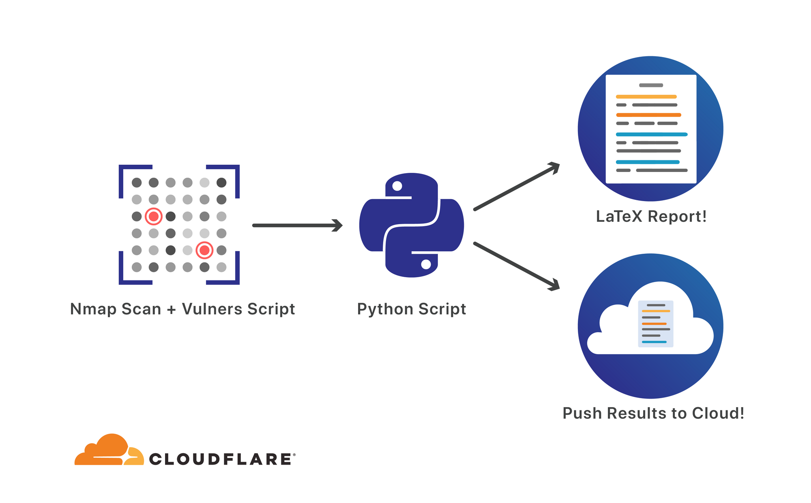
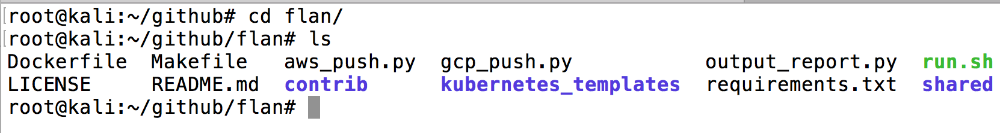
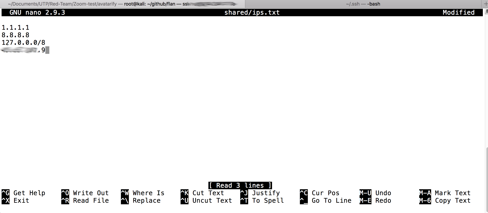
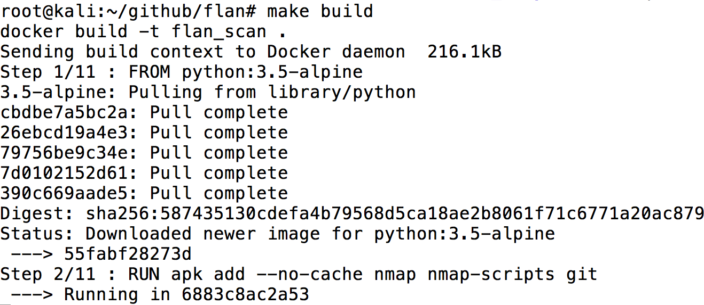
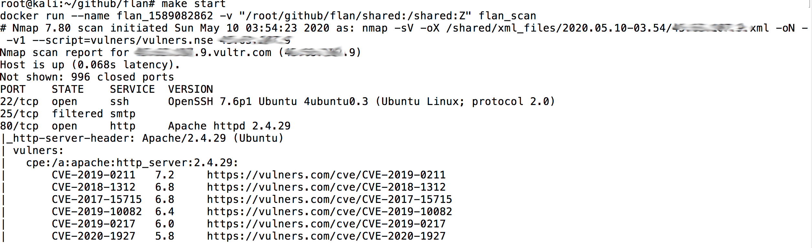
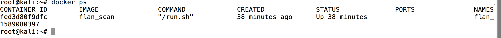
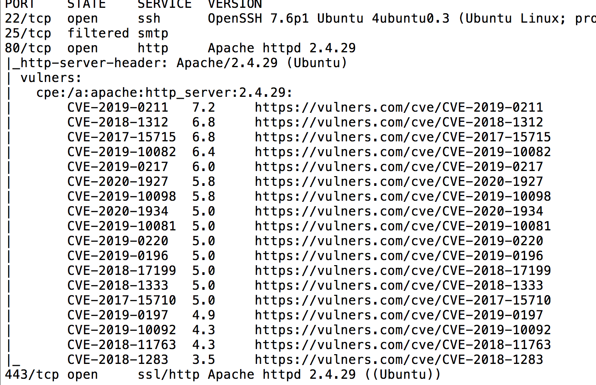
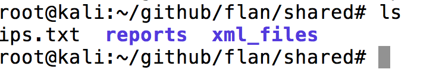
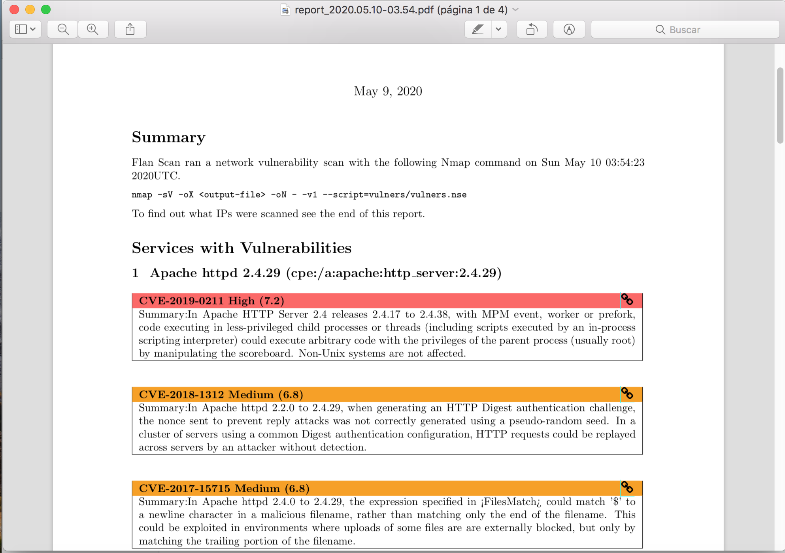
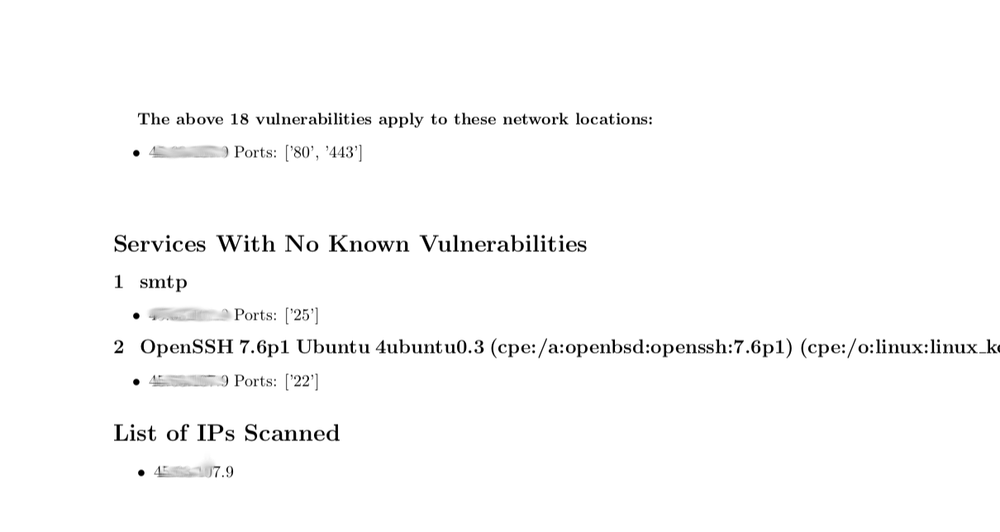

# Flan Scan 


###### ¿Qué es Flan Scan ?

Es una herramienta de escaneo de vulnerabilidades creado por cloudflare basada en nmap. La principal diferencia que existe la observamos en la instalación mientras que nmap lo instalamos por medio de paquetes o la fuente, **flan scan** se instala por medio de contenedores de dockers o por kubernetes.

**Flan Scan** permite creación de reportes de la salida normal a reportes de LaTex y a su vez enviar estos reportes a buckets de S3 o  de Google Cloud Buckets. De igual manera como parte los beneficios de esta herramientas es el motor de scripts NSE, que buscas resultados con los CVE de diversas fuenteas.

 La imagen a continuación vemos el funcionamiento de ***Flan scan***




##### Requerimientos

1. VPS les recomiendo [vultr.com](https://www.vultr.com/?ref=8403796-6G "vultr.com")
2. Docker instalado 
3. Tener los repositorios básicos de compilación en ubuntu o la distro que utilicen https://zoomadmin.com/HowToInstall/UbuntuPackage/make

##### Instalación

1. Clonamos el repositorio

```shell
git clone https://github.com/cloudflare/flan.git

```

2. Accedemos al repositorio 

```shell
cd flan
```



3. Modificamos el archivo **ips.txt**  en la ruta **~flan/share/** y agregamos el ip del objetivo dentro

```shell
nano shared/ips.txt
```



Debemos eliminar los ips que vienen por defecto **1.1.1.1** **8.8.8.8** **127.0.0.1**

4. Vamos hacer la compilación del flan scan en el directorio **flan**

```shell
make build
```



5. Iniciamos el scaneo con el comando 

```shell
make start
```



Este comando realiza lo siguiente:

```shell
nmap -sV -oX /shared/xml_files -oN - -v1 \$@ --script=vulners/vulners.nse ip.objetivo
```

A continuación la descripción de cada parámetro y comando

* **-sV** permite la detección de la versión.
* **-oX** habilita la escritura de los resultados en formato XML en el directorio **shared/xml_files**
* **-oN** Permite imprimir los resultados en la terminal y v1 muestra el nivel de verbose 
* **--script=vulners/vulners.nse** script de NMAP para detectar los CVE en el host
* **ip.obetivo** es el ip del objetivo.

6. Podemos observar el contedor que se levanto mientras se esta escaneando nuestro objetivo



El escaneo podemos observar como va realizando el procedimiento normal de nmap



La salido la encontramos en 



El directorio **reports** son los reportes en formato LaTex





##### Paramatros Personalizados 

```shell
 docker run -v $(CURDIR)/shared:/shared flan_scan <Nmap-flags>
```

Se pueden enviar comandos adicionales de nmap con el comando arriba expuesto, dado que es un contedor que contiene **NMAP**


##### Conclusiones

* Los reportes en LaTex son más organizados que la salida de texto y aunque se pueden procesar la salida y consumir los archivos en xml para obtenerreportes más bonitos y con colores, para una prueba rápida conviene flan scan, en lugar de importar o usar algún plugin, además las herramientas de pago dan reportes basados en nmap https://github.com/1N3/Sn1per
* De igual manera que cualquir contenedor contiene parámetros que podemos enviar además como dentro del contenedor lo que tiene es nmap podemos enviar búsquedas más avanzadas. 
* Permite enviar los reportes a S3 para ser consumidos luego por algún grupo de seguridad.
* La única desventaja está en la instalación de LaTex y sino sabes usarlo para componer el pdf, pero no toma más de 5 minutos instalarlo y componer el pdf final.


##### Referencias

* https://blog.cloudflare.com/introducing-flan-scan/
* https://securitytrails.com/blog/flan-scan-vulnerability-scanner
* https://securitytrails.com/blog/nmap-vulnerability-scan
* https://www.latex-project.org/get/
* https://github.com/cloudflare/flan
* https://www.hypn.za.net/blog/2018/01/25/running-nmap-in-aws-lambda/

